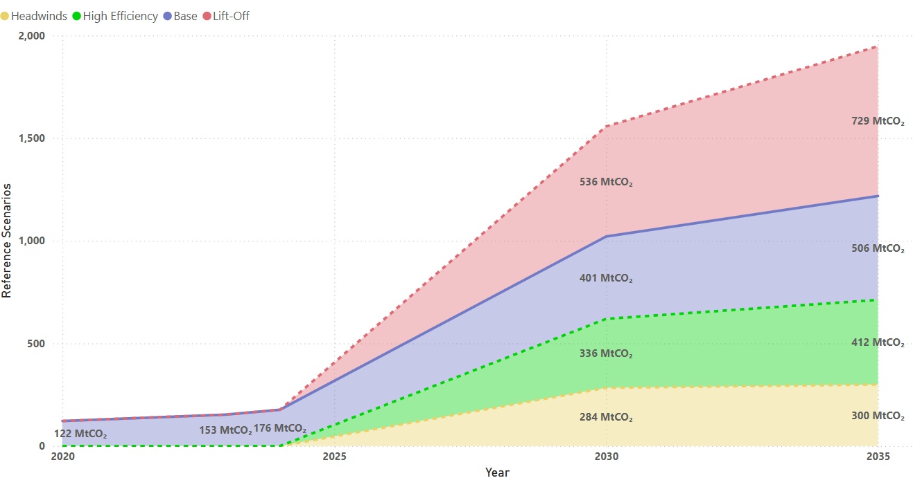
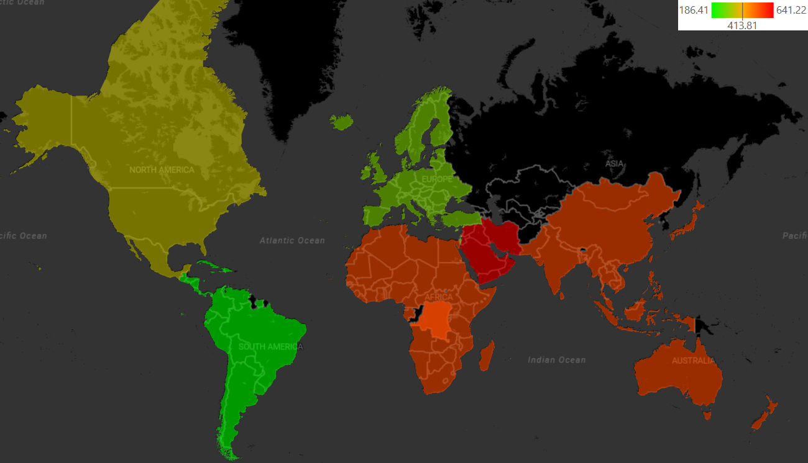
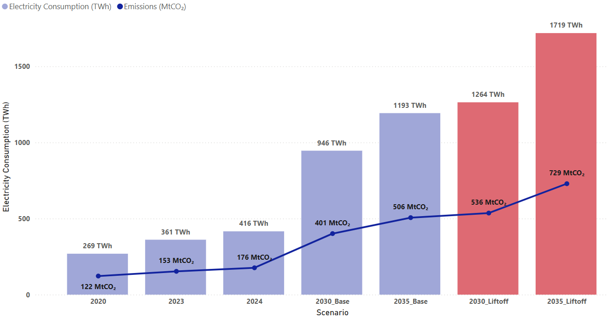
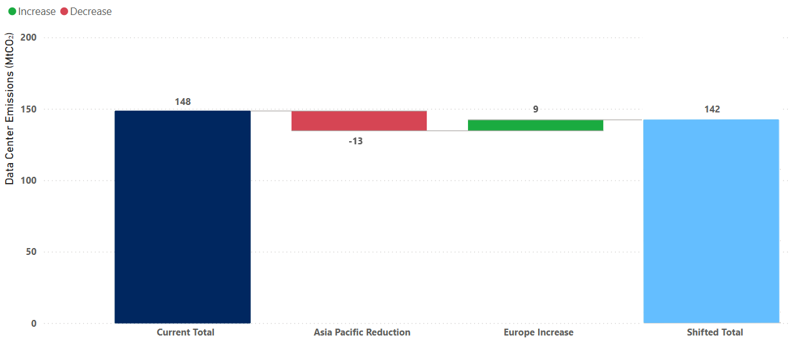
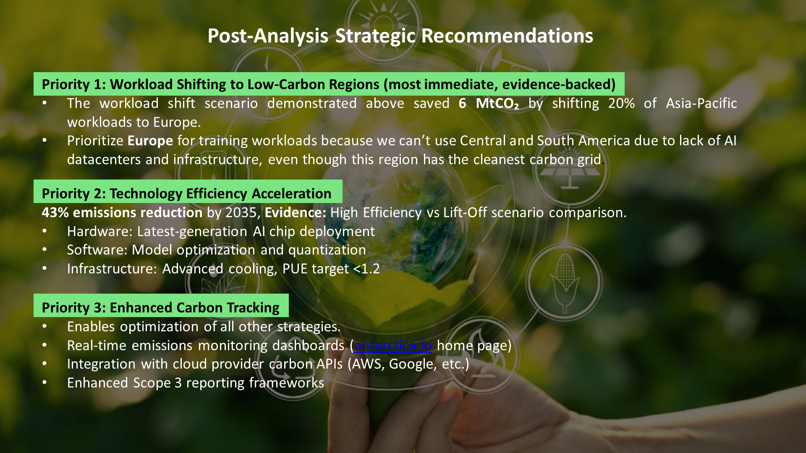

This is a data-driven analysis exploring how global AI workloads impact electricity use and CO₂ emissions, and how smarter cloud-region choices can dramatically reduce footprints. 

- Collected and cleaned real-world datasets from IEA and Our World in Data
- Modeled regional carbon intensity and data center electricity consumption
- Built dataframes and converted them to csv files to import them to Power BI for creating visuals
- Simulated workload shifting between regions, finding up to 6 MtCO₂ annual savings possible under realistic assumptions

---
### Stacked Area Chart of Projected Global Emissions

---
### Filled Map showing Carbon Intensity by Region

---
### Electricity Consumption with Carbon Emissions line 

---
### Waterfall Chart for Power Shift Scenario

---
### Sustainable IT Strategies

