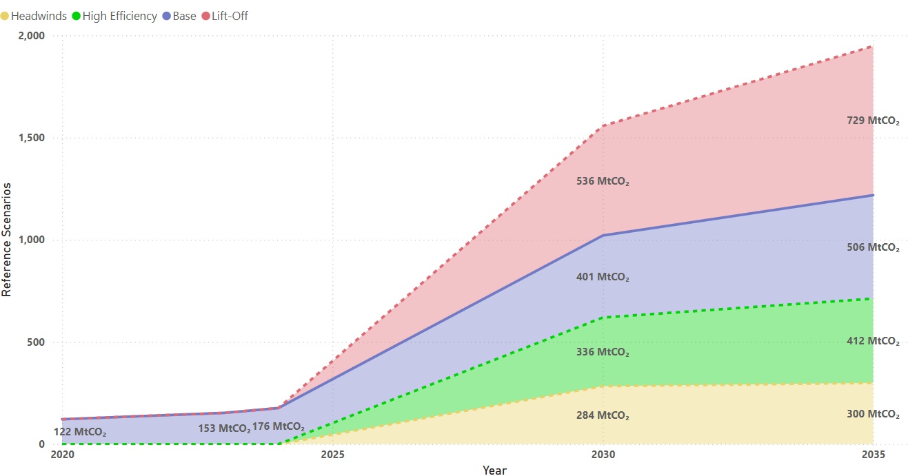
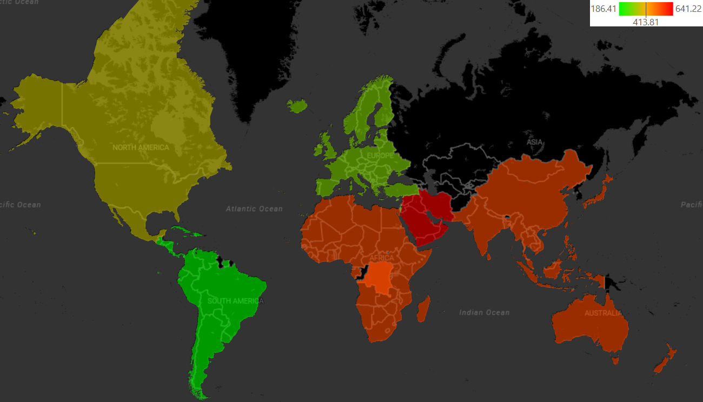

# Python-Data-Analysis-portfolio
This repository showcases my Data Analysis skills using Python and its frameworks (Pandas, Numpy, Seaborn, Matplotlib etc.)

Displayed below is a little glimpse of my proficiency in Python frameworks 👇🏻

---

---

---

---

---

---
